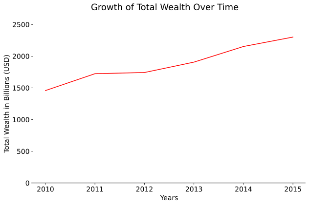
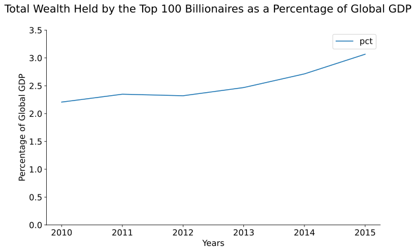
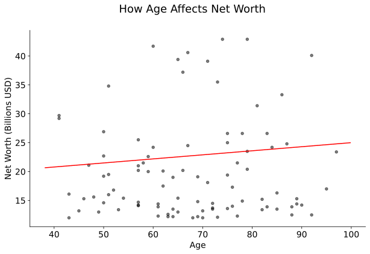
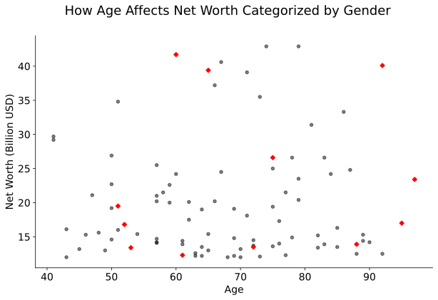
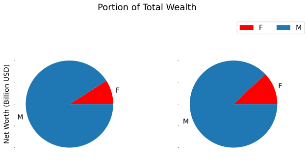
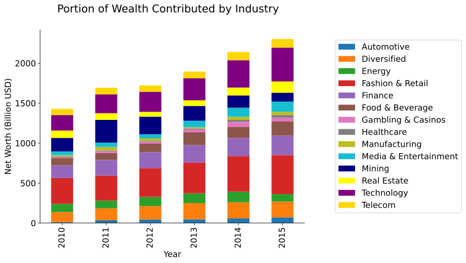
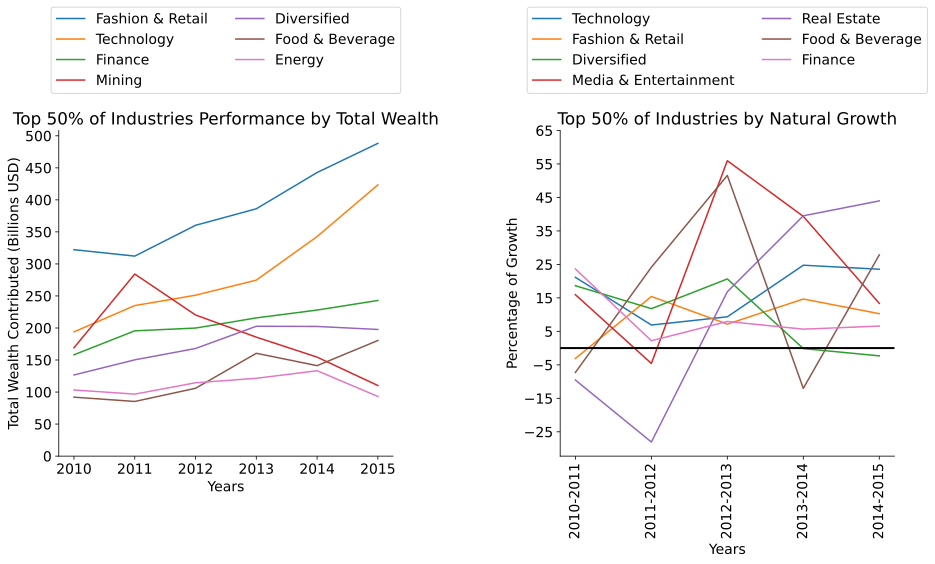
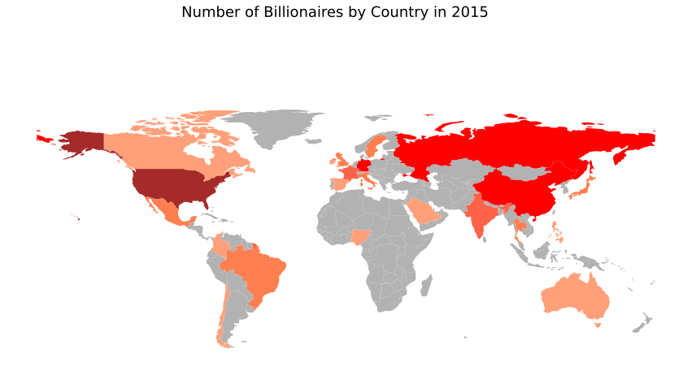
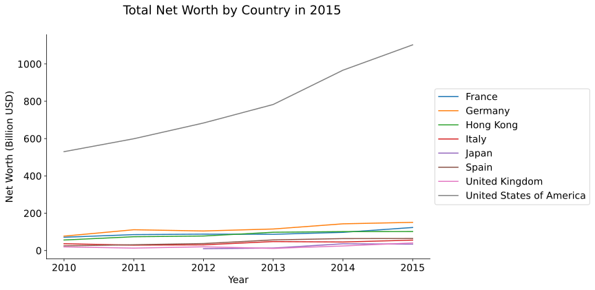

# BillionaireAnalysis
Analysis of the top 100 billionaires from 2010 - 2015

# Analysis of the World's Billionaires #

By: Jack Cassady

In the project I will be analyzing data from the Forbes Billionaires list, using the
top 100 richest people on the list from 2010 to 2015. With my analysis in the project,
I hope to find the characteristics and industries that make up the richest people in the
world. I will be looking at which industries have produced the most wealth as well as
which ones are changing at the fastest rates, as well as which nations produce the highest
amount of billionaires on the list and look at how gender effects wealth. Along with seeing
how these people have gained their wealth, my goal is to see how they compare with the rest
of the world by comparing against the world GDP from each of these years.

## Data ##

The data used to conduct my analysis was acquired from Forbes. It lists the
top 100 richest people in the world; in total there are 6 datasets that contain
information about each person in the list from 2010 to 2015. This information
includes, Rank, Name, Net Worth, Age, Nationality and after 2010 includes
the Source of Wealth. In addition to these original categories, the data has been
modified to include Gender and Industry.

The descriptions for each of these categories are listed below.

* Rank: The rank column shows the rank of the person in the list of billionaires.
  It includes ties and assists in showing changes to the list year by year.
* Name: Lists the name of the billionaire.
* Net Worth: Net worth shows the total estimated wealth for each person in the
list for the year that the data was recorded. This data is listed in terms of US dollars
and is in units of 1 billion.
* Age: Age is the age of the person in the year that that the data was recorded if applicable.
Some of the individuals on the list are listed in pairs or has combined wealth with family
members so an age is not applicable in such a case.
* Gender: This is the gender of the person on the list if applicable. Like with Age, the data
contains pairs or families, if the pairs contained individuals of opposite gender
the gender column was omitted.
* Nationality: Lists the country from which the individual resides.
* Source(s) of Wealth: Documents the major source of each person's wealth. This column is
only available after the 2010 dataset and lists either a specific company or industry that
contributed to the majority of total wealth.
* Industry: Industry is a more specific documentation of the source of wealth, categorizing each person into a specific industry or category of industry. There are 14 categories of industry utilized by Forbes, these are: Technology, Fashion & Retail, Finance, Telecom, Media & Entertainment, Energy, Real Estate, Gambling & Casinos, Food & Beverage, Automotive, Manufacturing, Mining, Healthcare, Logistics, and Diversified. Below is a description of each of these categories.
  * Technology: Contains industries that focus on creating new technology or innovations. This category is primarily software and internet technology.
  * Fashion & Retail: Contains high fashion and retail brands.
  * Finance: Financial industries and investors.
  * Telecom: Television and phone technology providers.
  * Media & Entertainment: Traditional media such news providers combined with celebrities and the movie industry
  * Energy: Energy providers; this also includes oil companies and gas refinement.
  * Real Estate: Real Estate developers and construction.
  * Gambling & Casinos: Industries that offer gambling.
  * Food & Beverage: Process and distribute food. This also includes packaging.
  * Automotive Producers of cars and trucks. While he could be considered a part of the technology industry, Elon Musk will be included here since his primary product is cars.
  * Manufacturing: Assembles or manufactures goods to sell to consumers or retail brands.
  * Mining: Large scale mining of ores such as gold, silver, or coal. This does not include oil drilling.
  * Healthcare: Healthcare providers such as hospitals or pharmaceuticals.
  * Logistics: Major shipping companies.
  * Diversified: Any individual whose majority of wealth did not come from a sole industry.
  
## Results ##
### Overall Analysis of Billionaires ###
I began my analysis by looking at the billionaires as a whole. My goal was to see how the wealth
of billionaires had changed over the time period I would be looking at. This includes the growth
of total wealth, then comparing how the total wealth had changed in comparison to the Global
GDP and analyzing how wealth changes as they get older.

The graph above shows how the combined wealth of the top 100 billionaires on the list has
changed over time. Looking at the graph we can clearly see that the total wealth has been
growing nearly linearly over the five years of data sampled. In fact, from 2010 to 2015 the
combined wealth grew by $843.9 billion. This is roughly 58% in growth over the time of the
sample. The highest increase from year to year can be found between 2010 and 2011 with a
nearly $300 billion increase. This tremendous increase in wealth can most likely be attributed to
a recovery from the 2008 Recession, which allows for cheaper investments allowing for a
increased growth in wealth overtime. In addition to the cheaper investment prices, the overall
growth in the prosperity of the economy following the recession makes consumers feel safer to
spend which ultimately benefits the billionaires on this list. It is important to put these numbers
into perspective to see how their wealth has changed compared to other people.

In order to gain some perspective on how the total wealth of billionaires has changed over time, I
looked at how their wealth had changed in comparison to the Global GDP. The graph above
shows how the percentage of the Global GDP held by the top 100 billionaires has grown in the
time of the sample. In 2010, billionaires held 2.21% of the Global GDP compared to 3.07% in
2015. This 0.86% increase in the percentage held by billionaires shows that not only has their
wealth been increasing as normal, but their buying power with this money has increased as well.
The increase in the share of the GDP exemplifies the growing gap between the middle class and
the top 1% that has been debated for the past few years. The majority of the cause for this
increase in the percentage held can be attributed to a sharp decline in the GDP in 2015 which
decreased by $4.28 Trillion from 2014. There is no real explanation for such a large decline in
the Global GDP, but it could likely be a cause of reduced growth in countries like the United States
which is normally a major contributor to the GDP while at the same time countries such as
Brazil had their GDP's shrink.

The last graph looks at how age affects the total net worth of someone on the list using the data
from the top 100 billionaires in 2015. As we can see from the graph the majority of billionaires
on the list sit near the bottom of the graph. In fact the average total net worth of billionaires in
2015 was $22.73 billion. I performed linear regression on this data in order to find the
relationship between age and net worth which can be represented by the linear equation below:

*Net Worth(Billions USD) = 0.07025051(Age) + 17.98358937*

Once again, we can see from the graph that the line sits fairly low on the graph, this leads me to
believe that there isn't a very strong relationship between age and net worth. This comes from a
generation of billionaires that are getting younger and richer. Previously people haven't reached
billionaire status until much later in their lives. Now, billionaires like Jeff Bezos, Mark
Zuckerberg, Larry Page, Sergey Brin and Elon Musk have gained their wealth at much younger
ages. I suspect that this trend may continue well into the future as technology becomes more and
more prevalent.

In order to further analyze the billionaires on the list, I broke down the list into smaller groups
such as Gender, Industry, and Countries to see how these factors impact wealth.

### Gender ###

The plot above shows the previous scatter plot displaying the differences in each gender as well.
Women are represented by red diamonds while men are the black circles. From the graph we can
obviously see that there are far more men on the top 100 list in 2015 than there are women; 11
women to 89. The interesting thing to mention is that roughly half of the women on the list (5)
are above the average of $22.73 billion. In fact, while the average net worth for men sits just
below the list average at $22.49 billion, the average for women sits above the average at $23.13
billion, which is a difference of $64 million.

Looking at the proportion of women to men in the top 100 billionaires the pie plots above show
the proportion of the total net worth held by men and women. We can see that the proportion of
wealth held by women has grown from 2010 to 2015. In 2010 women held about 9.02% of the
total wealth on the list while in 2015 the women hold 12.06%. You can see how the proportion
of wealth between men and women changes from 2010 to 2015 in the animation below. This
33.7% increase shows how women are slowly becoming wealthier and it will be interesting to
see how these numbers continue to change in the future.

Total change over time animation can be seen by downloading the total_wealth_change.mp4 file.

### Industry ###
To break down the analysis even further I looked at which industries had created the most wealth
in the top 100 list as well as which industries had the highest amount of positive natural growth.
There are 14 industries used by Forbes to describe each person on the list which are detailed in
data.

The graph above shows how the total wealth has changed over time as well as the contributions
by each of the 14 industries to the total wealth that year. We can see that the largest contributions
to the total wealth are Fashion & Retail with an average of $385.28 billion contributed each year
which is 20.7% of the average total wealth of the billionaires on the list. This is followed closely
by Technology and Finance which had averages of $286.83 billion and $206.75 billion with
about 15.4% and 11.1% of average total wealth respectively. Nearly half of all wealth from the
top 100 billionaires (47.2%) came from one of three Industries. We can look further at this data
using the next graph.

The next graphs shows the top half of industries in terms of total wealth contributions as well as
year to year percent change of total wealth for the Industries with the highest "natural growth". I
refer to it as natural growth because their total contribution is much higher, so they are less
susceptible to variation from changes to people in the top 100 list, rather than actual growth in
the industry. As I mentioned above, Fashion & Retail, Technology and Finance contribute the
highest amount of money to the top 100 billionaires, looking at the top half of wealth
contributing industries however, we see that on average nearly 80% of total wealth is contributed
by these industries. Moreover, the growth of all of these industries is strongly positive with the
exception of Mining. Looking at the Top 50% of Industries by Natural Growth graph, one
notable change among the industries is Real Estate; which had tremendous growth from 2010 to
2015 of nearly 52.7%, most likely as a result of a combination of cheaper real estate prices
following the 2008 Recession and population booms in South-East Asian countries like China.
Another notable change that can be seen in the Top 50% of Industries Performance by Total
Wealth is a spike in mining in 2011 followed by constant losses. From what I have found the
spike is most likely due to an increased interest in gold and silver which are known to be safe
investments during volatile markets such as the aftermath of the recession, then after 2011, prices
of commodities such as coal decreased as natural gas became cheaper resulting in a decline in
wealth.

### Countries ###

In looking at the ways in which billionaires have gained their wealth, it is important to
understand which countries are providing people with the opportunity to gain the money
necessary to reach this status.

The map above shows the number of billionaires in the top 100 that come from each country in
2015 with darker shades of red representing the countries with higher numbers of billionaires and
countries colored grey with none. We can see that the United States has the most billionaires by a
significant margin. In 2015, the United States had 41 billionaires in the top 100 list, while the
next closest country, Germany, had only 8. This significant difference in the number of
billionaires for the United States is thanks to its powerful economy that has traditionally
supported larger corporations with trade, taxes, economic freedom from government and skilled
labor. The combination of these factors provides a perfect environment for the United States to
produce mega wealth people. The next three countries on the list: Germany, China, and Russia,
also provide some of the factors that produce billionaires, however, in these countries
the government takes a much more controlling role over the economy than the United States.
Specifically, China and Russia have more totalitarian governments that take a controlling share
in some of the large corporations that operate there.

The graph above depicts the 8 highest countries in terms of growth. By far the highest amount of
wealth contributed to the list comes from the United States with $1.1 Trillion in 2015 which is
$951.4 Billion more than the next closest country. The United States also boasts an impressive
growth rate of 108% from 2010 to 2015 more than doubling its total wealth from $529.9 Billion
to the $1.1 Trillion previously mentioned. Even with this tremendous growth, the United States
is not first in terms of growth. Spain had the highest growth in total wealth at 158% followed by
Japan at 127% and the United Kingdom with 109%. Even with this slightly lower growth, the
United States continues to dominate in terms of contributions of total wealth.
